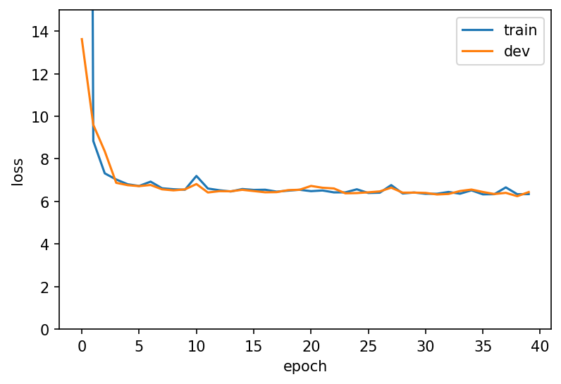

# COURSENET

I propose a deep learning method to standardize the names of departments across institutions. Although the application sounds specific, the capacity for a deep learning algorithm to detect similarities in courses across institutions can be extremely informative of similarities/differences in the content of courses (and, therefore, the skills graduates develop) at different colleges. The input for this project is a dataset of more than 3 million courses I have scraped from course catalogs published by a nationally diverse sample of colleges and universities. I will build a model that clusters departments based on course descriptions.

I describe pre-processing and implementation of the model in the accompanying write-up ``coursenet-writeup.pdf``. The base model for this analysis is a fully-connected sequential neural nework with 6 hidden layers. Each hidden layer uses a relu activation function, and the final hidden layer uses a softmax activation function to classify a department into one of 36 standardized categories. The model achieves approximately 80% accuracy in-sample and 74% accuracy out of sample, where classification errors arise largely due to the paucity of certain major categories in the raw data (for example, the small number of journalism courses are often absorbed into the substantially larger Literature and Language and Communications Fields). Convergence of the model is demonstrated over 40 epochs in the figure below.

  

